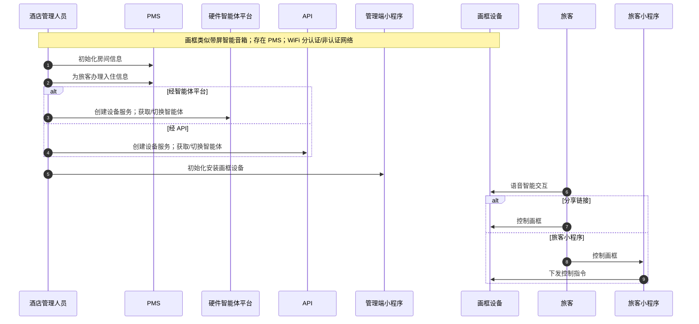
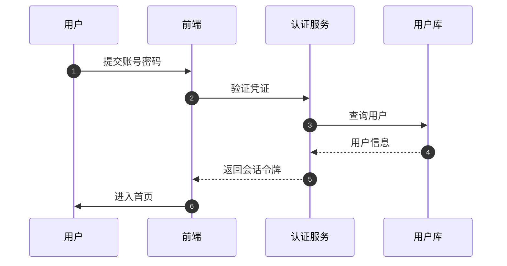

# 示例

## 示例 1：酒店智能画框（与 `流程图绘制.md` 对齐）

### 输入

```markdown
主题：酒店智能设备画框各用户角色流程，生成mermaid序列图
背景：
酒店智能设备画框类似百度音箱，但是可以有图和
酒店有酒店管理系统(PMS)
wifi认证和非认证网络

流程：
酒店管理人员通过pms系统初始化房间信息
酒店管理人员通过pms系统给旅客办理入住信息

酒店管理人员通过硬件智能体平台或者api，创建设备服务；创建获取智能体、切换智能体

酒店管理人员通过管理端小程序初始化安装画框设备
旅客通过语言和画框进行智能交互

旅客通过分享链接或者旅客小程序控制画框设备
```

### 输出



## 示例 2：用户登录（短例）

### 输入

```markdown
主题：用户登录校验流程

流程：
用户在登录页提交账号密码
前端调用认证服务验证凭证
认证服务查询用户库并签发会话令牌
前端携带令牌进入首页
```

### 输出


